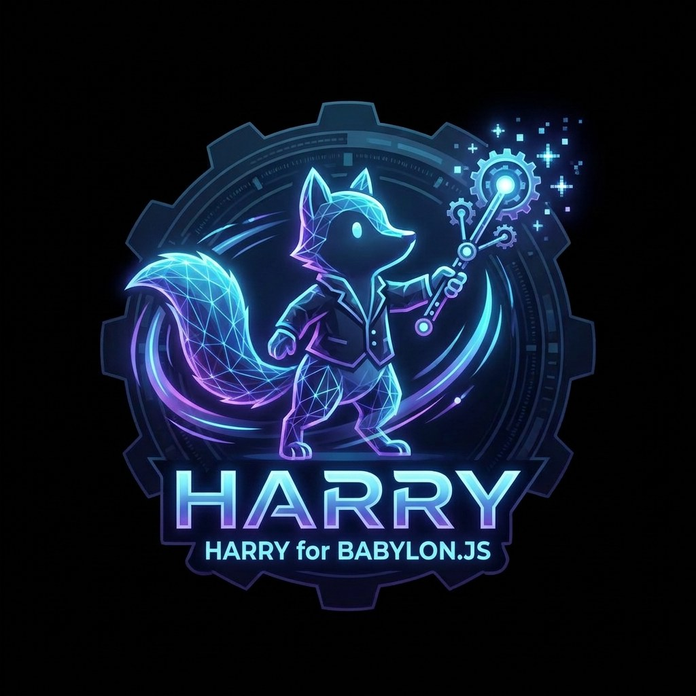

<p align="center"></p>

<p align="center"><a href="https://increasinglyhuman.github.io/harry-babylon/">Live demo</a> · <a href="LICENSE">MIT</a></p>

# harry-babylon

A Babylon.js runtime for avatars exported by [Harry](https://poqpoq.com/harry/), an avatar-finishing tool.

Harry writes an avatar's runtime behaviour into the GLB itself. This library reads it back in Babylon.js so the avatar behaves the way it did in Harry's preview:

- **Spring bones** for tails, hair and soft tissue: the standard `VRMC_springBone` 1.0 extension, solved with the VRM reference arithmetic on a fixed 60 Hz clock, so the motion doesn't change with frame rate.
- **Layered tail drive**: the spring follows the animation instead of its bind pose. It supports tail moods (`wag`, `lash`, `tuck`, `still`, `twitch`, `loose`) with cross-fades, plus a muscle, a cone limit and an optional balance reflex.
- **Surface jiggle**: modal oscillators drive sparse morph targets (chest, belly, glutes, attached hair). They stay in lockstep with the springs.
- **VRoid fallback**: a VRoid body whose extension was stripped by a re-export still gets springs. They're synthesised from its `J_Sec_*` / `J_Opt_*` bone names using VRoid Studio's own settings.
- **Clip binder**: binds a same-family clip to a skeleton by bone name. It strips root motion for locomotion, scales hip height to the body (grounded poses are exempt) and plays clavicles rest-anchored, so a body whose shoulders rest lower than the clip donor's doesn't shrug.

## About

Harry is an avatar-finishing tool: open a model from a generator such as Tripo or Meshy, or a Mixamo/VRoid character, and Harry gives it hands and fingers, elbows and knees that bend and crease where they should, a chest that holds its volume, tails that wag, and hair and soft tissue that bounce. It writes all of that into a standard glTF (GLB) file.

Most of it is plain glTF and works in any engine: the armature, the skin weights, the corrective bones and morphs, and baked animation. The springs use the public `VRMC_springBone` 1.0 extension, so VRM-aware tools (Blender's VRM add-on, three-vrm, UniVRM) can play them. The parts that are Harry's own (tail moods, surface jiggle, rest-anchored clavicles) need a runtime, and **harry-babylon is that runtime for Babylon.js**, the same code poqpoq World runs.

## Install

```sh
npm install harry-babylon @babylonjs/core @babylonjs/loaders
```

`@babylonjs/core` and `@babylonjs/loaders` (9.x) are peer dependencies.

## Usage

```ts
import { SceneLoader, type AbstractMesh, type TransformNode } from '@babylonjs/core'
import '@babylonjs/loaders/glTF/2.0/index.js'
import { attachHarryPhysics, bindClipToSkeleton } from 'harry-babylon' // registers the VRMC_springBone loader extension

const result = await SceneLoader.ImportMeshAsync('', '/avatars/', 'my-avatar.glb', scene)
const root = result.meshes[0] as unknown as TransformNode
// Set the avatar's final scale/rotation/position first: the springs capture their rest pose now.
const physics = attachHarryPhysics(root, scene, result.meshes as AbstractMesh[], { label: 'my-avatar' })

physics.springs?.setMood('wag') // false when no spring plays a layered drive
physics.springs?.setGround(() => ({ point: groundPoint, normal: groundNormal })) // optional floor for tails

// Optional: play a same-family clip loaded from another GLB.
const bind = bindClipToSkeleton(clipGroup, result.skeletons[0], 'idle', /* stripRootMotion */ false)
clipGroup.start(true)

// Later: physics.dispose()
```

Import `harry-babylon` before the avatar loads. Bundlers that drop side-effect-only imports can call `registerHarryLoaderExtension()` instead. `attachHarryPhysics` never throws for a file without springs: `springs` and `jiggle` are just `null`.

Set the avatar's final transform, and any static pose, before calling `attachHarryPhysics`. The spring runtime captures each joint's rest from the scene at that moment. A static pose on bones that aren't spring joints (relaxing the arms out of a T-pose, for example) is safe to apply first. If you pose spring joints later instead, call `physics.springs.requestReset()` afterwards.

Importing the package does two things: it registers the glTF loader extension, and it enables the VRoid fallback (module state only). It adds nothing to `globalThis`.

## Options

```ts
const physics = attachHarryPhysics(root, scene, meshes, {
  label: 'npc-7',          // console label (the old positional string form still works)
  springs: true,           // default true
  jiggle: true,            // default true
  lod: { near: 20, far: 50, farHz: 15, camera }, // default: no LOD (full rate at any distance)
  pauseOffscreen: false,   // default false
  budget,                  // from createHarryBudget(...)
  debug: false,            // true installs the __tailMood() / __surfaceJiggle() console probes
})
physics.setSpringsEnabled(false)
physics.setJiggleEnabled(false)
physics.setLod(null)
physics.setPauseOffscreen(true)
```

- **`springs` / `setSpringsEnabled`.** When off, the spring bones return to their bind rotations once. After that only the animation moves them, so they don't drift. When switched back on, the chain resets onto the current pose, so nothing snaps. Surface jiggle runs in lockstep with the springs (it steps only when the springs advanced, using their dt), so turning the springs off also rests the jiggle.
- **`jiggle` / `setJiggleEnabled`.** When off, every surface morph weight goes back to 0.
- **`lod`.** Distance is measured from `lod.camera`, or from `scene.activeCameras[0] ?? scene.activeCamera`, to the avatar root.
  - Within `near`: every frame.
  - Between `near` and `far`: `farHz` steps per second (default 15, minimum 5). Each step passes the whole accumulated dt to the solver and to the jiggle.
  - Beyond `far`: held. The avatar resets when it comes back in range.
  - Without `lod` there is no distance LOD at all. The lower-level `DeclaredSpringBones` class keeps a built-in default of 20 m / 50 m / every 3rd frame, which `attachHarryPhysics` turns off unless you pass `lod`.
- **`pauseOffscreen`.** Holds the springs while every drawable mesh of the avatar is outside the camera frustum, and resets when one comes back. Babylon tests skinned meshes against their bind-pose bounds, so a limb swung far outside those bounds can count as off-screen.
- **`budget`.** Created with `createHarryBudget(scene, { maxActive, camera?, everyNFrames = 30 })`. Every `everyNFrames` frames it ranks its avatars by camera distance. The nearest `maxActive` simulate and the rest are held. A held avatar's surface jiggle freezes rather than resting.

## Entry points

| Import | Contents |
|---|---|
| `harry-babylon` | Everything, plus loader-extension registration and the VRoid fallback for `attachHarryPhysics` |
| `harry-babylon/springs` | `DeclaredSpringBones`, `SpringBoneRuntime`, the `VRMC_springBone` parser, the layered drive, and the loader extension (registered on import) |
| `harry-babylon/jiggle` | `SurfaceJiggleReader`, the `extras.poqpoq.surface` parser, and the modal oscillator |
| `harry-babylon/clips` | `bindClipToSkeleton`, `REST_ANCHORED_BONES`, and the hip-height helpers |
| `harry-babylon/vroid` | VRoid spring synthesis: `springsFromVRoidNames`, `springsForBody`, and `registerVRoidSynthesis()` |
| `harry-babylon/playground` | The single-file Playground/CDN build (see below) |

`dist/` is plain ESM with explicit `.js` extensions, so it runs under Node's ESM loader as well as in bundlers.

Approximate sizes, minified, with Babylon external:

| Entry | Minified | Gzipped |
|---|---|---|
| main entry | 51 KB | 17.5 KB |
| `springs` | 33 KB | 11.2 KB |
| `jiggle` | 39 KB | 12.9 KB |
| `clips` | 3 KB | 1.4 KB |
| `vroid` | 38 KB | 12.8 KB |

`jiggle` and `vroid` both include the springs runtime they depend on. `npm run build` writes the current numbers to `dist/sizes.txt`.

## Babylon Playground / CDN

`dist/harry-babylon.playground.js` is one minified ES module (about 53 KB, 18 KB gzipped). It reads Babylon from the global `BABYLON`, which is how the Playground and the UMD CDN builds provide it, and doesn't bundle its own copy. Host the file anywhere that sends CORS headers (a CDN such as jsDelivr or unpkg serving the published package, or your own server). Then, in the Playground's **JavaScript** mode:

```js
export const createScene = async function () {
  const scene = new BABYLON.Scene(engine);
  const camera = new BABYLON.ArcRotateCamera('cam', 2.4, 1.35, 4, new BABYLON.Vector3(0, 0.9, 0), scene);
  camera.attachControl(canvas, true);
  new BABYLON.HemisphericLight('light', new BABYLON.Vector3(0, 1, 0), scene);

  // Wrapped in Function on purpose: the Playground's code processor rejects a literal import(url).
  const HB = await new Function('u', 'return import(u)')('https://YOUR-HOST/harry-babylon.playground.js');

  // Load the avatar AFTER the import: that registers the VRMC_springBone loader extension.
  const result = await BABYLON.SceneLoader.ImportMeshAsync('', 'https://YOUR-HOST/', 'avatar.glb', scene);
  const physics = HB.attachHarryPhysics(result.meshes[0], scene, result.meshes, { label: 'pg' });
  physics.springs?.setMood('wag');
  return scene;
};
```

This was tested in Playground 9.29.0 in JavaScript mode. A literal `await import(url)` fails there with "Parse error @:1:1"; the `new Function` wrapper above runs, and springs plus surface jiggle attached. The same file also works on a plain page that loads `babylon.js` and `babylonjs.loaders.min.js` from `cdn.babylonjs.com`, with no `<script type="module">` needed. The Playground's TypeScript mode wasn't tried.

## What the file must contain

- `extensions.VRMC_springBone` (spec 1.0 or 1.0-beta): springs, joints, colliders and collider groups.
- Optional, in Harry's extras namespace on each spring (`springs[i].extras.poqpoq`):
  - `drive`: the layered tail drive (`target: "animated-pose"`, `moodSet: "tail-moods@1"`, the mood table, the dynamics and per-bone axes). If it's absent or malformed, the spring plays passive.
  - `surface`: surface jiggle (`version: 1`, `tip`, `owner`, `gain`, `modes[]` naming `surface.<Region>.<k>` morph targets). If it's absent, nothing is registered and nothing is spent per frame.
- For the clip binder: a clip baked on the same rig family, whose GLB keeps the donor skeleton's rest pose.

Anything malformed is reported with a named `console.warn` and skipped. A file that declares springs never falls back to name guessing.

## Demo

```sh
npm install
npm run demo   # http://localhost:5190
```

The demo plays the avatar file's own walk clip and walks the avatar around a slow circle. The circle speed is matched to the stride, which the demo measures from the clip. The springs and surface jiggle ride on top, reacting to the root motion and the clip.
- **Controls:** walk on/off; **Hop**, which crossfades walk → hop → walk while the avatar keeps circling; **Squat (creases)**, which stops, loops an air squat and frames the elbows and knees from the side; front view; camera follow; physics on/off; and a tail mood that applies to every avatar.
- **Clips:** the hop and the squat are separate animation-only files. Each is bound to every avatar with `bindClipToSkeleton`, the showcase use of that function. Crowd instances get the hop but not the squat. Without a hop file, the hop falls back to a procedural bounce of the root.
- **Spawn crowd** adds 20 instances of the same loaded file on staggered rings. Each instance has its own cloned animation group, started at a random offset.
- **Budget** selects 6, 12 or 20. The crowd also uses a distance LOD of `near 12 m`, `far 40 m` at 15 Hz.
- **Status line:** shows how many avatars run at full rate, at reduced rate, or held. A held avatar's tail is frozen to save CPU; it resumes when the budget or distance promotes it again.

The scene uses Harry's own viewport look, rebuilt in Babylon in `demo/stage.ts` (`createHarryStage`): Khronos PBR Neutral tone mapping, an image-based fill at 0.45, and an off-axis key light at 2.6 with soft PCF shadows. As in Harry, the key sits over the camera's shoulder: it is placed relative to the camera's view direction every frame, so whatever the camera looks at is lit from the front and the shadow falls away from the viewer. The stage itself is a near-black void with a dark pool, a 40% shadow catcher and a 0.5 m grid, and it is exempt from tone mapping. The fill uses Babylon's `studio.env` from its asset CDN in place of three.js's procedural room environment, so the fill is close but not identical. A stats card shows fps, frame time, draw calls, active vertices, the avatar count, the full/reduced/held/off counts and the playing clip.

If the file has no animation, the demo instead relaxes the arms out of the T-pose. It does that before attaching physics, and the avatar stands in place.

### Demo assets

The demo avatar is **not distributed** with this repository: `demo/assets/` is git-ignored. Point the demo at your own Harry export in one of three ways, in this order of precedence:

1. the query parameter `http://localhost:5190/?avatar=<url-of-your.glb>`;
2. the environment variable `VITE_HARRY_DEMO_AVATAR=<url> npm run demo`;
3. a file at `demo/assets/lemur.glb`, the default.

The clips load from `?hop=<url>` and `?squat=<url>`, or default to `demo/assets/clips/hop.glb` and `demo/assets/clips/squat.glb`. Those are animation-only GLBs retargeted to the same skeleton.

Any GLB that Harry exported with `VRMC_springBone` works. If the file contains an animation, the demo loops its first animation group. `npm test` runs extra checks on `demo/assets/lemur.glb` and the clips when those files are present, and skips them with a message when it isn't.

`scripts/sanitize-glb.mjs` prepares a file for sharing. It strips generator UUID names and identifying `extras` strings. It also has two options:
- `--wag-default` sets every tail drive's wag knobs to Harry's tuned default, `{ amplitudeDeg: 45, hz: 0.5, bias: 0 }`. No other knob changes.
- `--wag <amplitudeDeg>,<hz>` sets the wag amplitude and rate explicitly and keeps the bias.
- `--surface-gain <spring>=<gain>` sets one spring's `extras.poqpoq.surface.gain`. It can be repeated.
- `--rename-animation <name>` renames a file's single animation.

```sh
node scripts/sanitize-glb.mjs --wag 65,0.5 --surface-gain jiggle-LeftBreast=0.45 --surface-gain jiggle-RightBreast=0.45 \
  --rename-animation walk my-export.glb demo/assets/lemur.glb
node scripts/sanitize-glb.mjs --rename-animation hop my-hop-clip.glb demo/assets/clips/hop.glb
```

## Clip binding: when you need `bindClipToSkeleton`

A Harry export that carries its own animation needs no binding. Its animation groups already target the file's own nodes, so you just `group.start(true)`. That's what the demo does for the walk.

Use `bindClipToSkeleton` when the clip comes from **a separate file**, such as a shared same-family animation library baked once and played on many bodies. The binder does four things:
- re-points each track to this body's bones by name;
- strips root motion for locomotion clips;
- scales the hip height to this body (grounded poses are exempt);
- plays the clavicles rest-anchored.

The demo shows the pattern in `demo/moves.ts`. It loads the clip with `SceneLoader.LoadAssetContainerAsync`, clones the group once per avatar (`group.clone(name, t => t, true, true)`, because binding rewrites targets and keys), calls `bindClipToSkeleton(clone, avatarSkeleton, 'hop', false)`, and crossfades with `AnimationGroup.weight`.

## Limitations

- `center` spaces from `VRMC_springBone` aren't supported. Springs that declare one are evaluated in world space, with a warning.
- Extended colliders (`VRMC_springBone_extended_collider`) aren't supported.
- The layered drive needs the file's declared step rate to equal the runtime's (60 Hz). Otherwise the spring plays passive.
- Step-for-step parity with Harry's own preview was measured outside this package. The tests here pin the properties that make it possible (frame-rate independence, rotation ownership, colliders, mirror invariance). They don't check against a reference avatar.

## Development

```sh
npm run build   # tsc → dist/ (with .d.ts), then the Playground bundle and dist/sizes.txt
npm test        # vitest
```

## License

The code is MIT: see [LICENSE](LICENSE). The demo's avatar and animations are **not** included and not MIT-licensed; they're shown in the hosted demo only. See [NOTICE.md](NOTICE.md) for what the licence covers, third-party credits, and the demo content.
